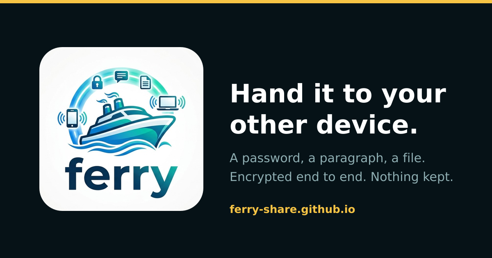

<div align="center">



<h1>Ferry</h1>

**Hand a password, a piece of text or a file from one device to another.**

The two browsers talk directly wherever the network allows it, everything is
encrypted end to end, and nothing is stored anywhere afterwards.

[**Open Ferry**](https://ferry-share.github.io) &nbsp;·&nbsp;
[How it works](https://ferry-share.github.io/how-it-works/) &nbsp;·&nbsp;
[FAQ](https://ferry-share.github.io/faq/) &nbsp;·&nbsp;
[Compare](https://ferry-share.github.io/compare/) &nbsp;·&nbsp;
[About](https://ferry-share.github.io/about/)

<sub>
No account &nbsp;·&nbsp; Nothing stored &nbsp;·&nbsp; Nothing logged &nbsp;·&nbsp;
MIT licensed &nbsp;·&nbsp; Free
</sub>

</div>

---

## The short version

You want a password off your laptop and onto your phone. The usual routes all
go through somebody else: email it and it sits on a mail server, drop it in a
chat and it lands in that company's storage, upload it and now the link is the
secret and the file is on a disk you do not control.

Ferry opens a channel straight between the two browsers instead:

```
  1. One device mints a ten-character code and shows it as a QR
  2. The other scans it, or you type the ten characters
  3. Both screens show four words — if they match, nobody is in the middle
  4. Send. Passwords, text, files up to 250 MB
```

It takes about ten seconds, and when you close the tab there is nothing left
to delete.

## What it is built from

| Piece | What it is | Where it runs |
| --- | --- | --- |
| Front end | Next.js, exported to static files | GitHub Pages |
| Relay | ~200 lines of JavaScript over WebSockets | Cloudflare Workers, or any Node host |
| Transport | WebRTC data channel, relay as fallback | Between the two browsers |
| Crypto | WebCrypto — ECDH P-256, HKDF, AES-256-GCM | In the browser, nowhere else |

---

## Why there is a relay at all

GitHub Pages serves static files. It cannot run Node, and it cannot hold a
WebSocket open. Two browsers that have never met need *something* to introduce
them, so a pairing tool always needs one small always-on process.

That process is treated as hostile by design — see
[How it works](https://ferry-share.github.io/how-it-works/) for why it cannot
read anything it carries. Ferry keeps both halves in this one repository and
gives you two ways to run them.

**Same network — one command, no hosting at all**

```bash
npm install
npm run lan
```

One Node process serves the built front end *and* the relay. It prints your LAN
address; open it on both devices and you are done. Nothing leaves your network.

**Over the internet — Pages plus a tiny relay**

| Piece | Where it runs | What it costs |
| --- | --- | --- |
| Front end (`src/`) | GitHub Pages, via the included workflow | Free |
| Relay | Cloudflare Workers, or Render/Fly/your own box | Free tier is plenty |

The relay is about 200 lines. It matches two sockets on a room id and forwards
bytes. It never sees your pairing code, your keys or your data, so hosting it
somewhere else costs you nothing in privacy.

---

## How it works

```
   Device A                       Relay                        Device B
      │                       (untrusted)                          │
      │  1. mint PIN, show QR                                      │
      │  2. join room = SHA-256(PIN) ───────────────────────────►  │
      │  3. exchange ECDH public keys ◄──────────────────────────► │
      │     session key = HKDF(ECDH shared secret, salt = f(PIN))  │
      │  4. compare four safety words on both screens              │
      │                                                            │
      │  5a. WebRTC data channel ═══════════════════════════════►  │   preferred
      │  5b. or encrypted frames through the relay ─────────────►  │   fallback
```

1. **The PIN is the only secret.** Ten Crockford base-32 characters, about 50
   bits, from `crypto.getRandomValues`. It travels in a QR code or in the URL
   fragment, which browsers never send to a server. On arrival the app strips it
   out of the address bar.

2. **The relay only ever learns a hash.** The room id is
   `SHA-256("ferry/v1/room:" + PIN)`, truncated. Knowing the room id tells you
   nothing about the PIN.

3. **Key agreement is bound to the PIN.** Both sides generate an ephemeral
   ECDH P-256 key pair and derive the session key with HKDF, *salted with a
   value derived from the PIN*. Anyone who does not know the PIN — including a
   malicious relay that inserts its own peer — derives a different key, so their
   frames fail authentication instantly. Keys are ephemeral, so capturing the
   traffic and learning the PIN later still does not decrypt it.

4. **Separate keys per direction**, so a frame can never be replayed back at the
   device that sent it.

5. **Four safety words** are derived from the session key and shown on both
   screens. Matching words are a human-checkable confirmation that no one is in
   the middle.

6. **Payloads are AES-256-GCM.** Even the WebRTC offer, answer and ICE
   candidates are encrypted before they reach the relay, so your local IP
   addresses are not exposed to it either.

Every property above is asserted in `test/`, against the real WebCrypto
implementation rather than a stand-in: both sides agree on a key and on the
same four words, the two directions use independent keys, a peer holding the
wrong PIN derives a different key and is refused, a tampered frame fails its
integrity check, and no nonce ever repeats. Run them with `npm test`.

### What Ferry deliberately does not protect against

- Anyone who obtains the PIN before the second device joins can take that slot.
  Rooms hold two devices and no more, so if a stranger got in first, your own
  device is refused and you will notice. Treat the code like a door key.
- A compromised device. End-to-end encryption ends at the endpoints.
- Traffic analysis by the relay: it can see that two sockets exchanged *n* bytes,
  just not what they were.

---

## Running it

Node 22 or newer. The test suite imports the TypeScript sources directly,
which relies on the type stripping Node enables by default from 22.18.

```bash
npm install

npm run dev          # front end at http://localhost:3000
npm run dev:relay    # relay at ws://localhost:8081/ws (second terminal)

npm run build        # static export into ./out
npm run lan          # build, then serve front end + relay together on your LAN
npm start            # relay only — this is what a host platform runs

npm run lint
npm run typecheck
npm test             # needs a build first: the LAN host tests serve ./out
```

`npm test` covers the relay (pairing, forwarding, a refused third device), the
crypto properties listed above, and the LAN host's refusal to serve anything
outside `./out`.

During `npm run dev` the app looks for a relay on its own origin. Point it at
the dev relay once via **Settings → Relay address**: `ws://localhost:8081/ws`.

> **Cameras need HTTPS.** Browsers only expose `getUserMedia` on secure origins,
> so QR scanning does not work over plain `http://192.168.x.x`. On a LAN, type
> the ten character code instead — or put the LAN host behind HTTPS.

---

## Deploying

### Front end → GitHub Pages

1. Push this repository to GitHub.
2. **Settings → Pages → Build and deployment → Source: GitHub Actions.**
3. Push to `main`. The included workflow builds the export and publishes it.

The workflow sets `NEXT_PUBLIC_BASE_PATH` for you: `/repo-name` for a project
site, empty for a `username.github.io` site.

### Relay → Cloudflare Workers (recommended)

Two ways, both free. Either produces the same Worker.

**From GitHub Actions — nothing to install**

1. In Cloudflare, create an API token from the **Edit Cloudflare Workers**
   template. It already carries the Workers Scripts and Durable Objects
   permissions this needs.
2. Add it to this repository as a secret named `CLOUDFLARE_API_TOKEN`
   (Settings → Secrets and variables → Actions → **Secrets**). A secret is
   write-only: it never appears in a log and cannot be read back out.
3. Run the **Deploy the relay to Cloudflare** workflow.

The run summary prints the relay address, ready to paste.

**From your own machine**

```bash
npx wrangler login
npx wrangler deploy
```

Either way you end up with a URL like
`https://ferry-relay.<your-subdomain>.workers.dev`. The relay address to give
Ferry is that host as a WebSocket, with `/ws` on the end:

```
wss://ferry-relay.<your-subdomain>.workers.dev/ws
```

Free, and unlike the options below it does not sleep — there is no half-minute
wait on the first pairing of the day. `wrangler.toml` and `worker/index.js`
are all it needs; wrangler itself is not a dependency of this repo, so `npx`
fetches it only when you deploy.

The Worker speaks exactly the protocol in `server/relay.js`. It keeps one
Durable Object per room id, which is how two browsers anywhere in the world
land on the same instance and meet.

### Relay → anywhere that runs Node

Only `ws` is a runtime dependency — Next, React and the rest are build-time
only — so `npm ci --omit=dev` on any of these installs a single package rather
than the whole front-end toolchain.

**Render** — New → Blueprint → pick this repo. `render.yaml` does the rest.

**Fly.io** — `fly launch --no-deploy && fly deploy`, using the included
`fly.toml`.

**Docker** — `docker build -t ferry-relay . && docker run -p 8081:8081 ferry-relay`

**Your own server** — `PORT=8081 node server/relay.js` behind nginx or Caddy
with a WebSocket upgrade on `/ws`.

Then tell the front end where it is. Ferry already ships with a working relay
as its default, so it pairs out of the box; you only need this if you would
rather run your own.

- **For everyone** — set a repository variable named `NEXT_PUBLIC_RELAY_URL`
  (Settings → Secrets and variables → Actions → **Variables**, not Secrets) to
  your `wss://…/ws` address, then re-run the Pages workflow. It is baked into
  the build, so every visitor gets it, and no source file has to change.
- **Just for you** — paste it into **Settings → Relay address** in the app. It
  is remembered in that browser only.

### Which relay a browser talks to

Highest priority wins:

1. Whatever that browser saved under **Settings → Relay address**.
2. The origin the page came from, when it can host a relay — `npm run lan` and
   self-hosted deployments serve one at `/ws`, and reaching past it would
   defeat the point of running it.
3. `NEXT_PUBLIC_RELAY_URL`, baked in at build time.
4. The relay Ferry ships with, in `src/lib/config.ts`.

The relay address is not a secret and the relay is not privileged: it only
ever sees a truncated hash of the PIN, and every payload is sealed with a key
derived from that PIN, which it never learns.

> Free Render and Fly instances sleep when idle, so the first pairing after a
> quiet spell waits for the relay to wake — commonly half a minute on Render.
> The Cloudflare Worker above does not have this problem.

### Optional: TURN

A small number of networks (symmetric NAT, some corporate Wi-Fi) block direct
peer-to-peer. Ferry notices and falls back to relaying encrypted frames, which
always works but is slower. If you would rather keep transfers peer-to-peer,
add TURN credentials under Settings.

---

## Project layout

```
src/
  app/
    page.tsx           the front page: the app, then the page about it
    about/             About Ferry, static HTML
    how-it-works/      the long explanation, static HTML
    faq/               every question, and its FAQPage markup
    compare/           Ferry next to AirDrop, WeTransfer and the rest
    site.ts            one place for the site's own URLs and its summary
    robots.ts          generated; names the AI crawlers explicitly
    sitemap.ts         generated, one entry per page
    layout.tsx         fonts, metadata, structured data
  content/
    faq.ts             the questions, shared by the FAQ page, its markup
                       and the short set on the front page
  components/
    SiteChrome.tsx     header, footer and breadcrumbs for the written pages
    HomeContent.tsx    the front page's prose, rendered on the server
    FerryApp.tsx       loads the app, and the static shell shown until it does
    JsonLd.tsx         structured data, escaped so it cannot break out
    Ferry.tsx          shell, header, settings
    Pairing.tsx        choose a side, host with QR, join, verify safety words
    Workspace.tsx      connection ribbon, composer, received items
    Qr.tsx             QR renderer and camera scanner
    ui.tsx             buttons, toasts, sheet, icons
  hooks/useSession.ts  binds the session to React
  lib/
    crypto.ts          PIN, room derivation, ECDH + HKDF, AES-GCM, safety words
    protocol.ts        binary frame format
    signaling.ts       relay client with reconnect and backoff
    transport.ts       WebRTC data channel, relay fallback, backpressure
    session.ts         state machine, send queue, receive assembly, expiry
    config.ts          relay resolution, ICE servers, device labels
assets/
  logo.png             the one source image every icon is cut from
scripts/
  generate-icons.mjs   cuts it, via `npm run icons`
server/
  relay.js             the rendezvous relay, for any Node host
  lan.js               static host + relay in one process
worker/
  index.js             the same relay for Cloudflare Workers
test/
  crypto.test.mjs      key agreement, directions, wrong PIN, tampering
  relay.test.js        pairing, forwarding, room limits, bad frames
  lan.test.js          the LAN host serves ./out and nothing else
  worker.test.mjs      the Worker relay matches the Node one, and routing
  config.test.mjs      which relay a browser ends up talking to
  seo.test.mjs         what the built pages tell crawlers, that they load
                       nothing from a third party, and that the share
                       banner stays small enough for WhatsApp
```

## Sharing a link

Paste the address into WhatsApp, Slack, X or an iMessage and the preview shows
the banner at the top of this file: the mark, the line, and what it costs. The
card is `public/opengraph-image.png`, generated at 1200×630 — the shape every
platform crops to — and kept under 100 KB, because WhatsApp quietly drops the
picture somewhere near 300 KB and tells you nothing about why.

`npm test` fails if that card stops being 1200×630, grows past the limit, or
stops matching what the page declares.

## Branding and search

The favicon, the installed-app icons and the social card are all cut from
`assets/logo.png`. Replace that file and run:

```bash
npm run icons
```

Small icons are cut from the ship alone, because the wordmark under it turns
to mush below about 64px; the social card, which is read at size, uses the
whole lockup on a dark ground.

Everything is served from this origin. A logo on someone else's CDN would hand
that CDN the address of every visitor, which sits badly with a page promising
it keeps no record of anyone — `npm test` fails if any absolute URL to another
host appears in the built page.

## Being found, and being described accurately

Two audiences read these pages without a person attached: search crawlers, and
the crawlers behind AI assistants. Neither runs JavaScript reliably, so
everything on this site that is prose rather than interface is rendered to
plain HTML at build time — the front page included, where the app itself still
mounts on top of it once the bundle arrives.

- **Every page reads without scripts.** `npm test` fails if any of them drops
  below a floor of visible text. The front page used to ship 157 characters of
  nothing, which is what an assistant asked to recommend a file-sharing tool
  had to work from.
- **Structured data describes one thing.** `layout.tsx` emits a `@graph` — a
  `WebApplication`, the site, and the person who made it, cross-referenced by
  `@id` — and each page adds its own: `HowTo`, `FAQPage`, `AboutPage`,
  breadcrumbs. The tests check that every reference resolves, and that nothing
  claims a rating or a review, because there are none.
- **The answers are marked up because they are on the page.** The FAQ's
  `FAQPage` data is generated from `src/content/faq.ts`, the same source the
  visible page renders from, and a test asserts every marked-up answer appears
  in the rendered text.
- **`robots.txt` names the AI crawlers.** `User-agent: *` already allows them;
  naming GPTBot, ClaudeBot, PerplexityBot, Google-Extended and the rest is the
  only unambiguous way to say a site wants to be read and quoted, and it
  survives being deployed behind a CDN that blocks them by default.
- **`public/llms.txt`** is a plain-text summary for language models: what Ferry
  is, what it cannot do, and which questions it is a good answer to. The limits
  are in it on purpose — a recommendation that omits them sends people to a
  tool that cannot do what they asked. A test keeps it in step with the
  sitemap.

## Behaviour worth knowing

- **Received items clear themselves.** Passwords after two minutes, text after
  five, files after fifteen. Each row offers *+2 min* and *Keep*.
- **Copying a password** offers a one-tap clipboard wipe afterwards.
- **Files stream** in 64 KB chunks with backpressure, so a 200 MB file does not
  blow up the tab. The cap on a single transfer is 250 MB.
- **Paste anywhere** to send a file. **Ctrl/⌘ + Enter** sends text.
- **Drag and drop** onto the file tab.
- Light and dark, keyboard focus rings throughout, and `prefers-reduced-motion`
  is respected.

## Browser support

Chrome, Edge, Firefox and Safari, on desktop and mobile. QR scanning uses
`BarcodeDetector` where available and falls back to `jsQR` elsewhere.

## Licence

MIT.
